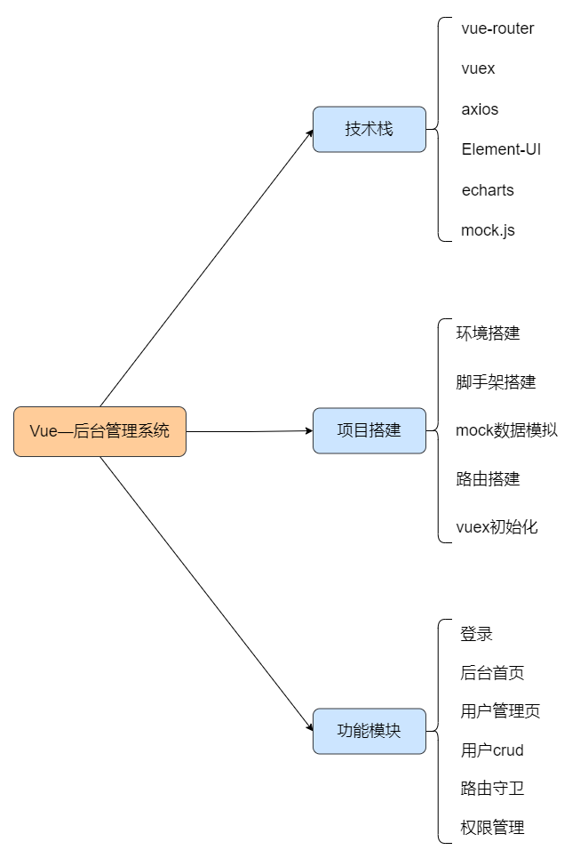

# 后台管理项目笔记

### 下载依赖
```
npm install
```
### 启动项目
```
npm run serve
```
### 打包项目
```
npm run build
```
## 项目大纲



### 技术栈

- **vue-router**：进行路由的切换以及控制
- **vuex**：对共享数据的管理
- **axios**：异步请求数据
- **elemen-ui**：UI组件库
- **echarts**：图表绘制
- **mock.js**：对数据的测试模拟

### 项目创建

- `npm install -g vue-cli`
- `vue create vue_test`

## Element-UI使用

- ### 全部引入

  ```js
  // 引入elmentUI
  import ElementUI from 'element-ui';
  import 'element-ui/lib/theme-chalk/index.css' // element样式
  ```

- ### 按需引入

  ```js
  //入口文件
  import { Button } from 'element-ui'
  ```

  ```js
  //babel.config.js文件
  module.exports = {
    presets: [
      '@vue/cli-plugin-babel/preset', // vue创建生产的
      ['@babel/preset-env', { 'modules': false }]
    ],
    plugins: [
      [
        'component',
        {
          'libraryName': 'element-ui',
          'styleLibraryName': 'theme-chalk'
        }
      ]
    ]
  ```

## 路由与菜单栏

关于路由，这在菜单栏和面包屑里面用的比较多，在登录页面的话只是需要把主页重定向到首页

菜单栏需要注意切换页面时不是简单的`this.$router.push`就行，还要考虑如果用户点击的不是其它菜单，而还是当前菜单，那么这时push相同页面路由就会引起**路由重复报错**，解决办法就是在此之前获取到当前路由并且与下一个跳转的路由进行对比，如果相同，则直接return，不进行跳转。

当使用el-menu时，会发现当不是由于点击菜单栏而引起的路由切换不会让菜单项高亮，比如点击面包屑导致的路由跳转，此时可以设置el-menu的`default-active`等于当前路由，即`$route.path`

面包屑的关闭需要注意当前路由的位置以及路由的排列顺序，可以借助el-tag的index很好的解决

为了设置权限，如果没有token凭证的话就直接跳转login页面，可以在入口文件设置导航守卫

```js
router.beforeEach((to, from, next) => {
  store.commit('user/getToken') // 将浏览器里的token放在state里面，防止刷新后页面跳回login
  const token = store.state.user.token
  if (!token && to.name !== 'login') {
    next({ name: 'login' })
  } else {
    next()
  }
})
```

### Vuex

为了更好的进行共享数据的使用和管理，设置了vuex，**集中式存储**管理应用的所有组件的状态，解决多组件数据通信。为了方便起见，且并不需要在vuex中使用异步请求，这里则是省略掉了action，直接在mutations中进行业务处理以及数据操作，并且使用**modules拆分业务**，用namespaced开启命名空间，这样使用不同的业务逻辑中的方法时更加清晰，提高代码可读性。

使用vuex最大的感受就是可以随处访问到共享数据state，非常方便，不需要组件间传来传去，不过当使用的地方增多时，也会导致调试的麻烦，不清楚在哪里更改了数据，因此也是要精简点用

由于需要不同用户进入后台能够使用的权限不同，因此登录前**根据用户身份的不同设置不同的菜单栏选项**，因此这里可以把菜单栏放入state中进行管理。

## 面包屑导航思路

面包屑是在head部分组件里,Tag标签虽然不再head部分组件里,但是它在整个管理后台系统中是会一直存在的，所以需要在Main.vue中。

这两块功能的实现,主要依赖Element-ui两个样式 Breadcrumb 面包屑 + Tag 标签


整个大致逻辑是这样的,首先是面包屑 首页一定要存在的,接下来侧边组件点击某菜单,把这个数据存到vuex中，然后头部组件来获取vuex中这个数据并展示。

## 用户名单渲染

这里借助作用域插槽可以很方便的渲染出所有用户，不过也较难理解，通过slot-scope，scope相当于一行的数据，scope.row相当于当前行的数据对象。这里就是用插槽拿到当前行，通过v-for 一列一列的渲染。

row是个内置的属性 ，vue slot的scope传递值是父作用域中的源数据改变，值会同步改变。且{{scope.$index}}可以获取当前行的index。

```vue
<el-table :data="tableData" height="100%" stripe>
      <!-- 遍历出前五列 -->
      <el-table-column
        show-overflow-tooltip
        v-for="item in tableLabel"
        :key="item.prop"
        :label="item.label"
        :width="item.width ? item.width : 125"
      >
        <!-- scope是一行的所有属性，里面的row存着数据 -->
        <template slot-scope="qwe">
          <span style="margin-left: 10px">{{ qwe.row[item.prop] }}</span>
        </template>
      </el-table-column>
</el-table>
```


## 分页栏

这里并没有一份一份的请求数据，而是一次性将后台mock模拟的数据全部请求回来，共200个，分成10页，依次排序，而点击页号也是通过调用函数再次进行数据请求，请求回来的依旧是200所有用户数据，只是当前展示的是在另外一个页号的用户，这里是异步请求的，因此后台的数据并没有发生变化，而刷新页面的话就会重新随机一批用户。这也是这个项目的一个诟病。

优化：后期可以模仿web端抖音博主的视频列表请求，一次请求10份，而每次请求中加些参数，如

用户开始序号start：12，

请求数量count：10，

这样每次切换页面进行浏览时只需要请求10份数据，而不是所有。


## 封装form表单组件 

假设现在我们有一个封装好的commonForm组件 那么这两个form表单的值应该是通过属性传递过来的 那么这里在传递的时候就有两份值 并且每一份值都不一样

应该数组里面套对象，每个对象的类型都不一样 那么每个对象里面的类型对应的就是form item的类型

也就是说我们label对应的数据待会是要传过来的，那么我们设计这一部分的传过来的值是这种类型的 

```js
[
  {
      label: '姓名',
      type: 'input'
  },
  {
      label: '年龄',
      type: 'input'
  },
]

```


- commonForm.vue

```vue
  <template>
  <!--是否行内表单-->
    <el-form ref="form" label-width="100px">
      <!--标签显示名称-->
      <el-form-item v-for="item in formLabel" :key="item.label" :label="item.label">
      </el-form-item>
    </el-form>
  </template>

  <script>
  export default {
    // formLabel 是标签数据
    props: {
      formLabel: Array,
    },
  };
  </script>
  <style lang="scss" scoped></style>


```

- User.vue

```vue
<template>
  <div>
    <common-form :formLabel="operateFormLabel"></common-form>
  </div>
</template>
<script>
import CommonForm from "../../components/CommonFrom.vue";
export default {
  components: {
    CommonForm,
  },
  data() {
    return {
      operateFormLabel: [
        {
          label: "姓名",
          type: "input",
        },
        {
          label: "年龄",
          type: "input",
        },
      ],
    };
  },
};
</script>
```

此时可以看到遍历出来了但是没有表单的类型 也就是input 框 select框这些 那么理所当然能都想到 刚刚传过来的值里面有type所以 根据type判断 那么就有了

CommonFrom.vue

```vue
<template>
  <!--是否行内表单-->
  <el-form ref="form" label-width="100px">
    <!--标签显示名称-->
    <el-form-item v-for="item in formLabel" :key="item.label" :label="item.label">
      <!--根据type来显示是什么标签-->
      <el-input
        :placeholder="'请输入' + item.label"
        v-if="item.type === 'input'"
      ></el-input>
      <el-switch v-if="item.type === 'switch'"></el-switch>
      <el-date-picker
        type="date"
        placeholder="选择日期"
        v-if="item.type === 'date'"
        value-format="yyyy-MM-dd"
      >
      </el-date-picker>
      
    </el-form-item>
  </el-form>
</template>
```

- 如果是select 肯定有 options 是需要遍历的 那么就会多套一层数据结构

```vue
  
    <el-select  placeholder="请选择" v-if="item.type === 'select'">
          <!--如果是select或者checkbox 、Radio就还需要选项信息-->
        <el-option v-for="item in item.opts" :key="item.value" :label="item.label" :value="item.value"></el-option>
    </el-select>

```

此时我们考虑完了 type 接下来的就是**表单双向绑定的值**

肯定也是传过来，父组件传过来值的类型依然是对象 

```js User.vue
   data() {
    return {
      operateFormLabel: [
        {
          label: "姓名",
          type: "input",
        },
        {
          label: "年龄",
          type: "input",
        },
      ],
      operateForm: {
        name: "",
        addr: "",
        age: "",
        birth: "",
        sex: "",
      },
    };
  },

```

```js CommonForm.vue
  export default {
    // formLabel 是标签数据
    // form是表单数据
    props: {
      formLabel: Array,
      form: Object,
    },
  };


```

- 注意：在el-form上 受:model控制

```js
<el-form ref="form" label-width="100px" :model="form">
</el-form>
```

思考 那么formitem上面的 v-model怎么对应起来呢 那我们在传上一个formLabel的时候 可以在对象的key值里面加一个model与之对应

```js
<el-input v-model="form[item.model]" :placeholder="'请输入' + item.label" v-if="item.type==='input'"></el-input>

```

```js
operateFormLabel: [
                    {
                        model: 'name',
                        label: '姓名',
                        type: 'input'
                    },
                    {
                        model: 'age',
                        label: '年龄',
                        type: 'input'
                    },
                    {
                        model: 'sex',
                        label: '性别',
                        type: 'select',
                        opts: [
                            {
                                label: '男',
                                value: 1
                            },
                            {
                                label: '女',
                                value: 0
                            }
                        ]
                    },
                    {
                        model: 'birth',
                        label: '出生日期',
                        type: 'date'
                    },
                    {
                        model: 'addr',
                        label: '地址',
                        type: 'input'
                    }
                ],

```

### 预留一个插槽 不一样的地方可以灵活的处理

```js
<el-form-item><slot></slot></el-form-item>
```

```vue
   <common-form >
        <el-button type="primary" @click="getList(searchFrom.keyword)">搜索</el-button>
      </common-form>
```

### 登录权限

我们给系统添加一个登录凭证叫"token"，这个token在登录的时候通过接口请求将用户名和密码传给后端，后端再数据库中匹配成功后返回一个凭证，前端将token缓存起来，再调用接口时传给后端验证就建立了登录权限校验

Mock数据 permission

```js
import Mock from 'mockjs'
export default {
  getMenu: config => {
    const { username, password } = JSON.parse(config.body)
    // 先判断用户是否存在
    // 判断账号和密码是否对应
    if (username === 'admin' && password === 'admin') {
      return {
        code: 20000,
        data: {
          menu: [
            {
              path: '/',
              name: 'home',
              label: '首页',
              icon: 's-home',
              url: 'home/index'
            },
            {
              path: '/mall',
              name: 'mall',
              label: '商品管理',
              icon: 'video-play',
              url: 'mall/index'
            },
            {
              path: '/user',
              name: 'user',
              label: '用户管理',
              icon: 'user',
              url: 'User/index'
            },
            {
              label: '其他',
              icon: 'location',
              children: [
                {
                  path: '/page1',
                  name: 'page1',
                  label: '页面1',
                  icon: 'setting',
                  url: 'other/pageOne'
                },
                {
                  path: '/page2',
                  name: 'page2',
                  label: '页面2',
                  icon: 'setting',
                  url: 'other/pageTwo'
                }
              ]
            }
          ],
          token: Mock.Random.guid(),
          message: '获取成功'
        }
      }
    } else if (username === 'xiaoxiao' && password === 'xiaoxiao') {
      return {
        code: 20000,
        data: {
          menu: [
            {
              path: '/',
              name: 'home',
              label: '首页',
              icon: 's-home',
              url: 'home/index'
            },
            {
              path: '/video',
              name: 'video',
              label: '商品管理',
              icon: 'video-play',
              url: 'mall/index'
            }
          ],
          token: Mock.Random.guid(),
          message: '获取成功'
        }
      }
    } else {
      return {
        code: -999,
        data: {
          message: '密码错误'
        }
      }
    }

  }
}

```

## 二次封装axios

二次封装axios主要是为了用到**请求拦截器**和**响应拦截器**

拦截请求：可以在请求之前处理一些业务(比如为每个请求带上相应的参数，时间戳等）

拦截响应：可以在服务器返回数据之后处理一些事情（比如对返回的状态进行判断，token是否过期等

```js
const baseUrl = process.env.NODE_ENV === 'development' ? config.baseUrl.dev : config.baseUrl.pro

class HttpRequest {
    constructor() {
        this.baseUrl = baseUrl
    }

    getInsideConfig() {
        const config = {
            baseUrl: this.baseUrl, //   根路径/api/
            header: {}      //请求头
        }
        return config
    }
    // 拦截器
    interceptors(axios) {
        // 添加请求拦截器
        axios.interceptors.request.use(function (config) {
            // 在发送请求之前做些什么
            return config
        }, function (error) {
            // 对请求错误做些什么
            return Promise.reject(error)
        })

        // 添加响应拦截器
        axios.interceptors.response.use(function (response) {
            console.log("数据请求成功!", response, 'response');
            // 在响应数据做些什么
            return response
        }, function (error) {
            console.log("数据请求失败!", error, 'error');
            // 对响应错误做些什么
            return Promise.reject(error)
        })
    }
    request(options) {
        // 创建axios实例
        const instance = axios.create()
        // 添加基础路径以及请求头header到options里
        options = { ...this.getInsideConfig(), ...options }
        // 给实例添加拦截器
        this.interceptors(instance)
        // 返回axios
        return instance(options)
    }
}

export default new HttpRequest(baseUrl)
```

## Mock.js拦截Ajax请求

记录用于生成响应数据的函数。当拦截到匹配 url 的 Ajax 请求时，函数 function(options) 将被执行，并把执行结果作为响应数据返回。路径可以随便写，只要和data.js里面的路径一致就行，表示从哪里请求数据，即使哪里都没有,目的是拦截请求再传回自己的数据

```js
Mock.mock('/homes/getData', homeApi.getStatisticalData)
// 添加用户
Mock.mock(/user\/add/, 'post', userApi.createUser)
// 更新用户
Mock.mock(/user\/edit/, 'post', userApi.updateUser)
// 删除用户
Mock.mock(/user\/del/, 'get', userApi.deleteUser)
// 得到用户列表
Mock.mock(/user\/getUser/, 'get', userApi.getUserList)
// 登录获取菜单权限
Mock.mock(/permission\/getMenu/, 'get', permissionApi.getMenu)
```

